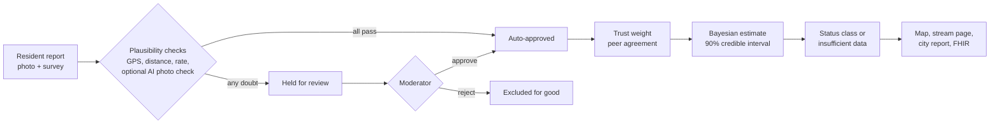
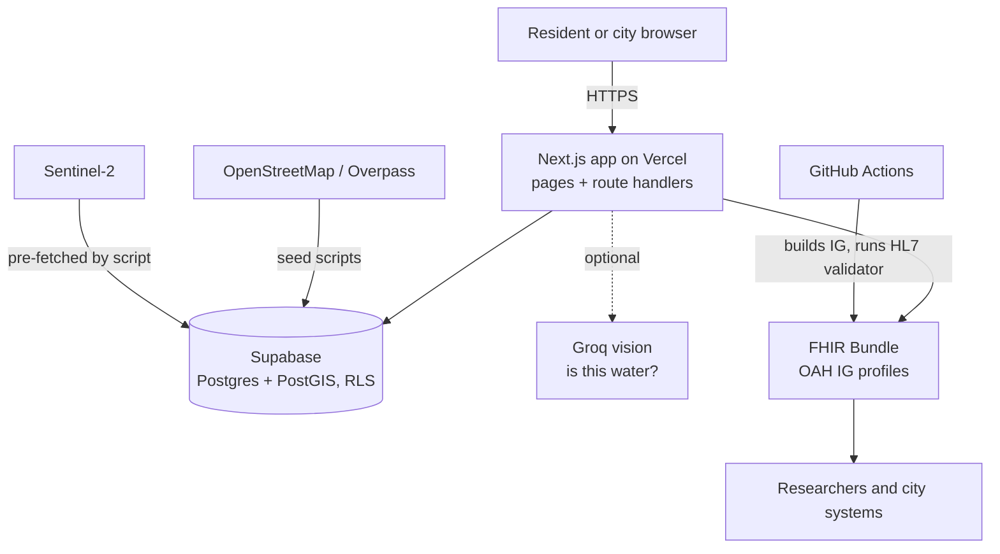
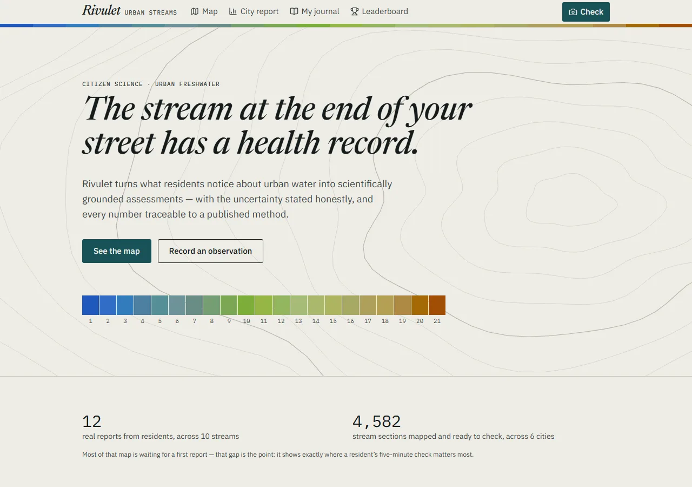
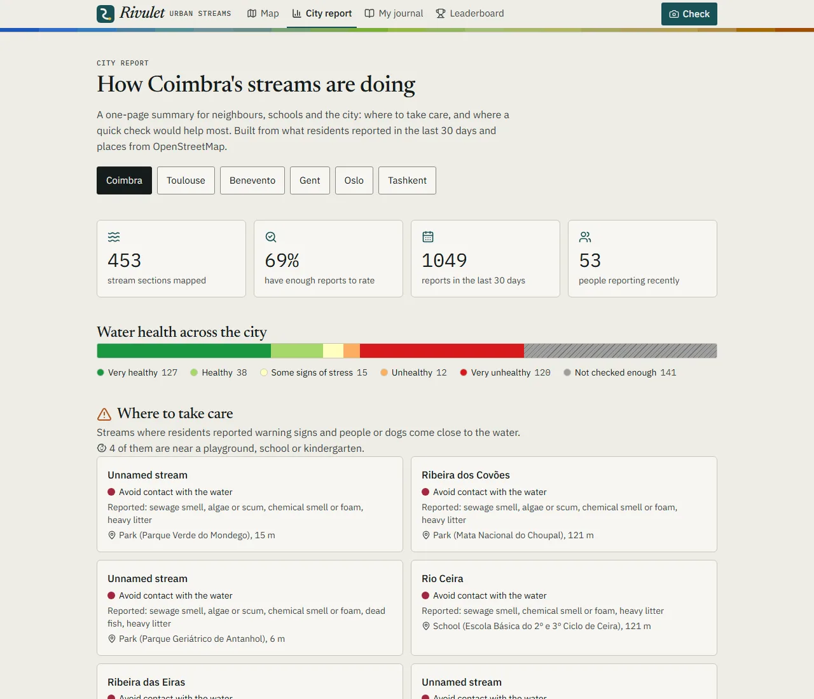
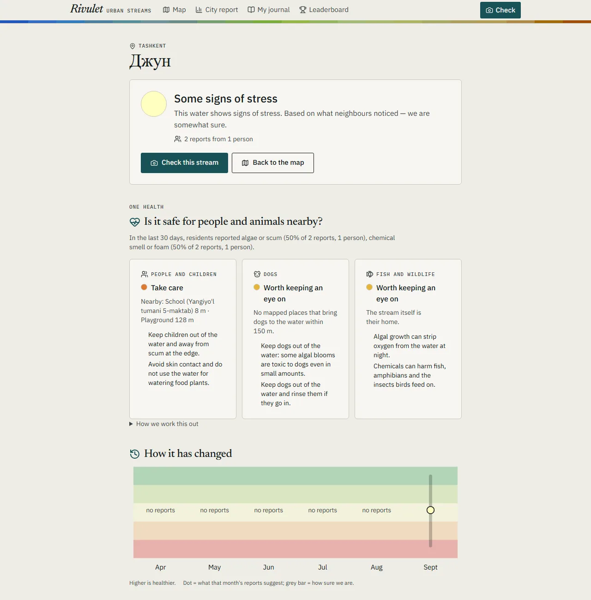
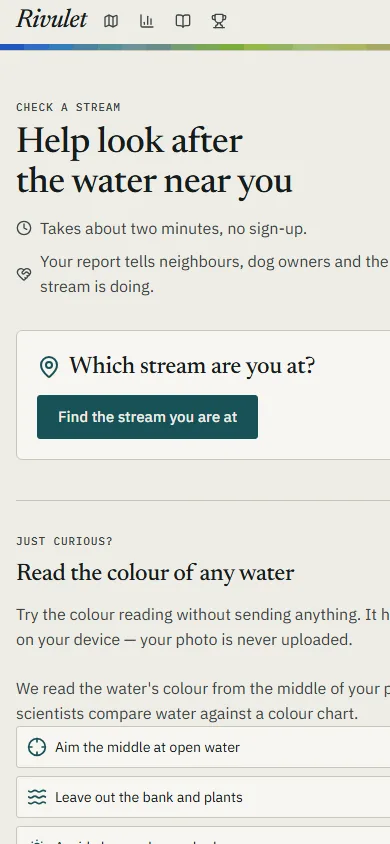
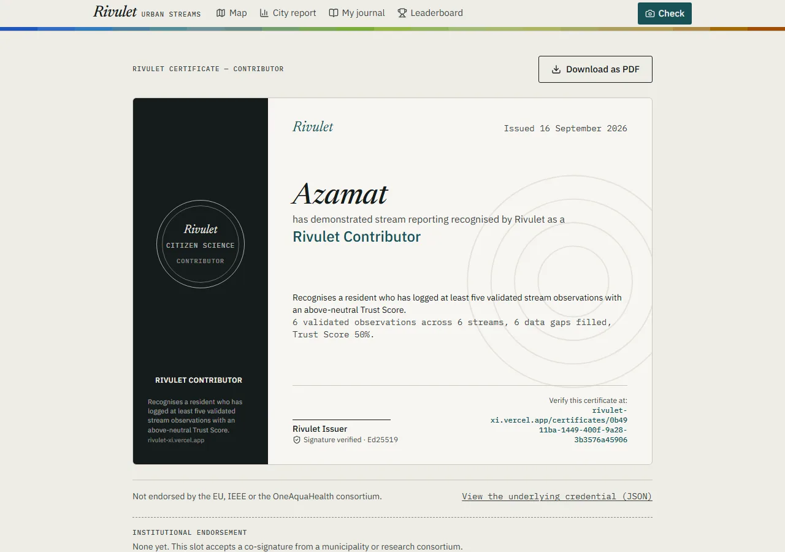
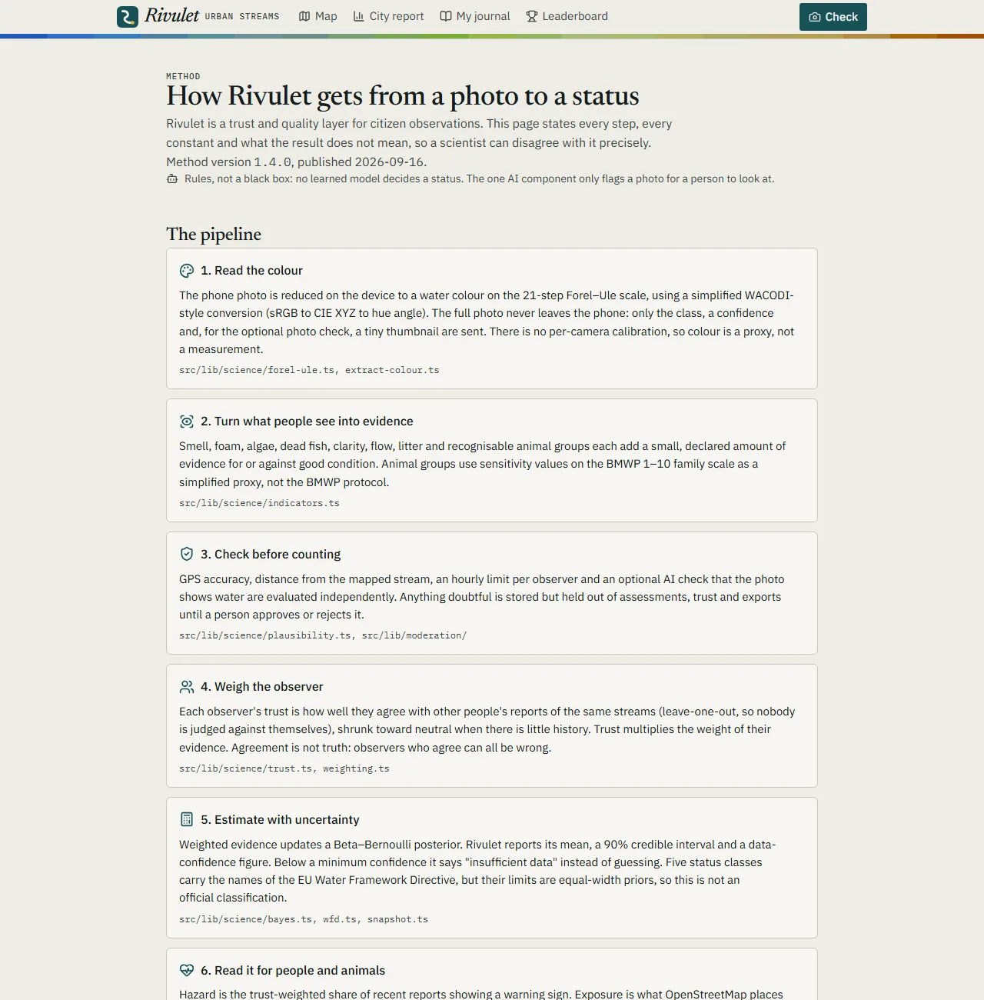

<div align="center">


# Rivulet

> A resident notices a stream. Rivulet tells the city how much to trust it, and where to look next.

A trust and quality layer for citizen observations of urban freshwater: photo and a few plain questions
in, an uncertainty-aware stream status, a One Health reading and a FHIR export out.

<table>
<tr>
<td align="center">🌐<br><b>Live</b><br><a href="https://rivulet-xi.vercel.app">rivulet-xi.vercel.app</a></td>
<td align="center">🏁<br><b>Track</b><br>2 — Data-to-Insight<br><sub>also 5 &amp; 7</sub></td>
<td align="center">🧱<br><b>Stack</b><br>Next.js · Supabase · FHIR</td>
<td align="center">📄<br><b>Licence</b><br><a href="LICENSE">Apache-2.0</a></td>
</tr>
</table>

[Map](https://rivulet-xi.vercel.app/map) · [City report](https://rivulet-xi.vercel.app/city) ·
[Method](https://rivulet-xi.vercel.app/method) · [Open data](https://rivulet-xi.vercel.app/open-data) ·
[Architecture](docs/ARCHITECTURE.md) · [API](docs/API.md) · [Science](docs/SCIENCE.md) ·
[Submission text](docs/SUBMISSION.md)

Built for the [OneAquaHealth IEEE Global Hackathon 2026](https://oneaquahealth-ieee-hackathon.devpost.com/).

</div>

---

### Contents

[Why this exists](#why-this-exists) · [Status](#status) · [How it works](#how-it-works) ·
[Screenshots](#screenshots) · [Documentation](#documentation) · [Highlights](#highlights) ·
[Scientific basis](#scientific-basis) · [Relationship to OneAquaHealth](#relationship-to-oneaquahealth) ·
[What Rivulet does not claim](#what-rivulet-does-not-claim) ·
[Synthetic demonstration data](#synthetic-demonstration-data) · [Getting started](#getting-started) ·
[Project layout](#project-layout) · [Contributing &amp; security](#contributing--security) ·
[Licence and attribution](#licence-and-attribution)

## Why this exists

- Small urban streams and canals are rarely monitored, and residents who would gladly help have no way to make their reports comparable.
- A citizen report is only useful if someone can say how far to trust it: where it was made, when, by whom, and whether it agrees with others.
- Cities cannot tell where a check is needed first, so effort goes where it is loudest, not where it matters.

## Status

| | |
|---|---|
| Build | [](https://github.com/it-withend/rivulet/actions/workflows/ci.yml) — type-check, ESLint and the Vitest suite |
| FHIR conformance | [](https://github.com/it-withend/rivulet/actions/workflows/validate-fhir.yml) — [full validator log](https://github.com/it-withend/rivulet/tree/fhir-validation-report) |
| Standard | -orange?style=flat-square)  |
| Dependencies | `npm audit` runs clean; see [`ci.yml`](.github/workflows/ci.yml) |

## How it works

### The two-minute walkthrough

1. **Report** — a resident picks a stream, photographs the water and answers a few plain questions, in about two minutes with no account. The colour is read on the phone (Forel–Ule). → [`/observe`](https://rivulet-xi.vercel.app/observe)
2. **Check** — GPS accuracy, distance from the stream, rate limits and an optional AI "is this water?" photo check run independently; anything doubtful is held for a person. → `/moderate`, `flag_reason`
3. **Trust** — each observer earns a trust score from agreement with other observers, which weights their reports. → `observers.trust_score`
4. **Estimate** — a Bayesian model combines the weighted reports into a WFD-named status class with a 90% credible interval; too little data reads "insufficient data". → stream page, map
5. **Interpret** — a One Health reading combines warning signs with nearby playgrounds, schools, parks and dog areas; a Sentinel-2 cross-check adds a coarse second opinion. → stream page, map layers, `/city`
6. **Share** — volunteers get a signed, verifiable certificate; researchers get the data as FHIR. → `/certificates/<id>`, `/api/fhir/Observation`

### The trust pipeline



### System architecture



## Screenshots

<table>
<tr>
<td width="34%"><br/><sub align="center">Home — the Forel–Ule colour ribbon as the signature element</sub></td>
<td width="34%"><br/><sub>City report — where to take care, where a visit helps most</sub></td>
<td width="32%"><br/><sub>Stream page — status, One Health reading, history</sub></td>
</tr>
<tr>
<td><br/><sub>The two-minute report form, on a phone</sub></td>
<td><br/><sub>A signed volunteer certificate — seal, signature, QR</sub></td>
<td><br/><sub>/method — every declared constant, generated live</sub></td>
</tr>
</table>

Screenshots show the live prototype. Coimbra's reports are synthetic demonstration data — see
[What Rivulet does not claim](#what-rivulet-does-not-claim).

## Documentation

- [`docs/ARCHITECTURE.md`](docs/ARCHITECTURE.md) — layers, data model, security and privacy, performance
- [`docs/SCIENCE.md`](docs/SCIENCE.md) — the science engine, its basis, and how the survey relates to the OneAquaHealth field protocols
- [`docs/API.md`](docs/API.md) — every endpoint, including the read-only FHIR API
- [`docs/SUBMISSION.md`](docs/SUBMISSION.md) — Devpost text, track statement, limitations and the pilot plan
- [`docs/DEMO_SCRIPT.md`](docs/DEMO_SCRIPT.md) — the 3–5 minute video, second by second
- [`/method`](https://rivulet-xi.vercel.app/method) — the method as a live page, every constant included, generated from the code's own registry

## Highlights

### Science, trust and standards

- 🔎 **Uncertainty first** — every status carries a 90% credible interval; missing evidence is "insufficient data", never good news.
- 🤝 **Trust, not just counts** — observers are weighted by peer agreement; doubtful reports wait for human review and never enter the model unchecked.
- 🐕 **One Health** — warning signs are read against the places people and dogs actually use, not in isolation.
- 🛰️ **Satellite cross-check** — Sentinel-2 hue against the resident's photo colour; divergence widens uncertainty instead of overruling.
- 🧪 **A declared method** — every constant is a cited standard or a labelled, uncalibrated prior, published live on [`/method`](https://rivulet-xi.vercel.app/method).
- 📤 **A read-only FHIR endpoint** — Locations, Observations, Provenance and DetectedIssues follow the OneAquaHealth IG, checked by the HL7 validator in CI (0 errors).

### Product and privacy

- 🗺️ **A report a city can act on** — [`/city`](https://rivulet-xi.vercel.app/city) names where to take care and where a visit would help most.
- 🏅 **Recognition that verifies** — Open Badges 3.0 certificates, signed with Ed25519, downloadable as PDF, honest about having no institutional endorsement.
- 📴 **Works with a poor connection** — installable PWA; a report written without signal is kept on the phone and sent, with its true time, when the connection returns.
- 🔒 **Privacy by design** — pseudonymous observer, colour read on the device, only a tiny thumbnail ever leaves it, and only for the optional photo check.

## Scientific basis

Seven stages, all in `src/lib/science/` with tests beside them, and no learned model deciding a status:

1. **Colour** — the photo is reduced on the phone to a Forel–Ule class, with a simplified WACODI-style conversion (Novoa, Wernand & van der Woerd 2013; Novoa et al. 2015) and IEC 61966-2-1:1999 sRGB colour management. There is no per-camera calibration.
2. **Evidence** — signs and recognisable animal groups add declared amounts of evidence for or against good condition. Animal-group sensitivity sits on the BMWP 1–10 family scale (Armitage, Moss, Wright & Furse 1983) — a simplified proxy, not the BMWP protocol.
3. **Plausibility** — GPS accuracy, distance from the mapped stream, an hourly rate limit and an optional AI photo check are evaluated independently; anything doubtful is stored but held out of assessments, trust and exports until a person reviews it.
4. **Trust** — leave-one-out peer agreement, shrunk toward neutral (Gelman et al. 2013, ch. 5), weights each observer's evidence. Agreement is not truth: observers who agree with each other can all be wrong.
5. **Estimate** — Beta–Bernoulli conjugate Bayesian updating (Gelman et al., *Bayesian Data Analysis*, 3rd ed., 2013) gives a mean, a 90% equal-tailed credible interval and a data-confidence figure; below a minimum confidence the answer is "insufficient data".
6. **One Health** — hazard is the trust-weighted share of reports from the last 30 days showing a warning sign (sewage smell, algae or scum, chemical smell or foam, dead fish, heavy litter); exposure is what OpenStreetMap places within 150 m (playgrounds, schools, kindergartens, parks, dog parks, bathing and fishing spots, picnic sites, allotments). A hazard near a place people or dogs use raises the concern; no recent reports reads as unknown, never as safe. It is a prompt to take care, not a public-health or bathing-water assessment.
7. **Satellite cross-check** — a Sentinel-2 hue angle for the stream is compared with the residents' colour; divergence beyond a declared threshold halves every contributing weight, so the estimate widens instead of being overruled. Most urban streams are narrower than a 10 m pixel, so most stay "no clear satellite view" — that is honest, not missing data.

The full registry, with a rationale for every entry (cited standard, or a declared prior with why it was chosen), lives
in `src/lib/science/method-parameters.ts` and is rendered live at [`/method`](https://rivulet-xi.vercel.app/method);
`ScoreDisclosure` (`src/components/water/ScoreDisclosure.tsx`) surfaces it in the product itself under "Why this
score?". Full citations are in `src/lib/science/method-version.ts`; the fuller description, a diagram and the
relation to the OneAquaHealth field protocols are in [`docs/SCIENCE.md`](docs/SCIENCE.md).

FHIR resources declare the HL7 Europe OneAquaHealth Implementation Guide profiles for indicators and locations. Real
measurements (pH, dissolved oxygen, temperature, nitrate) use the guide's codes; signs a resident sees but cannot
measure (clarity, sewage smell, algae, foam, dead fish, litter, flow state, the animal-group score) use a separate
Rivulet code system, served at `/fhir/CodeSystem/rivulet-derived` — see
[Relationship to OneAquaHealth](#relationship-to-oneaquahealth) for exactly what was and was not checked.

**Human review.** `/moderate` lists everything currently held for review, with the reason, and lets a moderator
approve (`human_approved`, counted exactly like `auto_approved`) or reject (`rejected`, permanently excluded) an
observation; either action recomputes trust for every observer on that water body. There are no moderator accounts —
set `RIVULET_MODERATOR_TOKEN` to a shared passphrase; the page is unusable until that is configured. This is
deliberately minimal: right for a two-person team reviewing a pilot, not a production moderation system.

**Optional photo check.** If `GROQ_API_KEY` is set, a small (~160px, never stored) thumbnail of each submitted photo
is sent once to a Groq vision model asking "does this look like water?". A confident "no" — a meme, a selfie, a
screenshot — flags the observation for review instead of silently entering the model; a missing key, a timeout, or
an uncertain answer all mean the check is skipped, never that the observation is flagged. The full-resolution photo
is never uploaded, matching the on-device colour reading. Every plausibility signal is evaluated independently and
all that apply are recorded in `flag_reason`, so a report already flagged for one reason still gets its photo
checked for the others.

**Certificates as a downloadable, printable document.** `/certificates/<id>` renders as a landscape card (seal,
drawn signature, QR verification code) instead of a plain page, and `/api/certificates/<id>/pdf` (pure `pdf-lib`, no
headless browser) returns the same design as an actual PDF file for a CV or portfolio. A revoked certificate, or one
whose signature does not verify, is refused as a PDF rather than rendered.

**Limitations, stated explicitly.** Photo-derived colour is a proxy for water quality, not a laboratory measurement.
Citizen observations are spatially biased toward accessible banks. Below a minimum data confidence, Rivulet reports
"insufficient data" rather than guessing — missing evidence is never presented as good news.

## Relationship to OneAquaHealth

The OneAquaHealth consortium has already built a CitizenScience App, a Community platform, an AI-based Environmental
Surveillance System, a Decision Support System, and a FHIR Implementation Guide. Rivulet is an independent prototype:
it is not affiliated with, endorsed by, or connected to the consortium's systems, and it is deliberately the
complement to that stack, not a replacement for it — citizen data collection already exists, so Rivulet builds the
quality and trust layer that turns resident observations into estimates with measurable uncertainty, expressed in
WFD classes and encoded in the consortium's own FHIR Implementation Guide. What it does use, and what it does not:

**Used — the OAH-FHIR Implementation Guide** (`hl7-eu/oah`, FHIR 4.0.1, canonical `http://hl7.eu/fhir/ig/oah`).
Rivulet serves a read-only FHIR endpoint at `/fhir` (with a `CapabilityStatement` at `/fhir/metadata`; see
[`docs/API.md`](docs/API.md)) and a one-stream export at `/api/fhir/Observation?waterbody=<id>`. Locations declare
`…/StructureDefinition/location-oah` and Observations declare `…/StructureDefinition/observation-indicators-oah`;
each report also gets a `Provenance` (author and assembling app), and a One Health warning becomes a `DetectedIssue`
evidenced by the reports behind it. Where the guide's code system (`temporarySystem-oah-eu`) has a code for
something Rivulet reports (pH, dissolved oxygen, water temperature, nitrate, …) that code is used; where it has none
(water colour, resident-reported signs, the flow state and animal-group score a resident reports, the classified
outcome) Rivulet's own code system is used and served at its canonical URL. Every exported value also carries the
stated way it was derived as an `Observation.note`, so a proxy is never mistaken for a measurement.

**Validated in CI with the official HL7 validator.** `.github/workflows/validate-fhir.yml` builds the guide from
source (`hl7-eu/oah` at a pinned commit, SUSHI 3.20.1), generates FHIR from Rivulet's own mapping code
(`validation/generate-samples.ts` calls the same functions the API serves) and runs `validator_cli` 6.10.4 against
FHIR 4.0.1 plus the guide and Rivulet's own CodeSystem. The workflow publishes the full log and the exact resources
it checked to the [`fhir-validation-report`](https://github.com/it-withend/rivulet/tree/fhir-validation-report)
branch. **Current result: 0 errors** across five checked files (a sample export, the endpoint's search bundles, its
CapabilityStatement and its CodeSystem). The warnings are of two kinds: resources without a narrative (`dom-6`, a
best-practice recommendation) and UCUM codes the offline validator cannot look up. The job found and fixed real
defects along the way — profile canonicals built from the profile *name* instead of its *id*, `Location` missing the
mandatory `identifier` and `mode`, and code displays that disagreed with Rivulet's CodeSystem.

<details>
<summary>What this validation does and does not show</summary>

It covers a bundle built from three representative reports (35 resources) and the endpoint's own responses, not
every row in the live database. It runs offline (`-tx n/a`), so external terminologies (UCUM units, SNOMED) are not
checked. Known gaps: `performer` is a display string, not a reference; the guide binds `code` to its indicator value
set as *preferred*, so Rivulet's own codes are permitted. The guide's `foam` concept is "Foam/colour/smell" (three
signs in one), so Rivulet keeps its narrower `surface-foam` code rather than stretching the guide's meaning.

To reproduce locally you need Node.js 22 and Java 17+:

```bash
bash validation/build-ig.sh && npx tsx validation/generate-samples.ts && bash validation/validate.sh
```

</details>

**Not used — OneAquaHealth's applications.** The CitizenScience App, Community, city dashboards and Resilience Map
are login-gated, and no public API or open-data endpoint for them was found in the project's public material
(checked 2026-09-21). Rivulet therefore neither reads from nor writes to them; the FHIR export is the
interoperability path. The Resilience Map covers the same five pilot cities (Benevento, Coimbra, Ghent, Oslo,
Toulouse) and can export CSV, which would be a natural cross-check for a later phase. The city report links out to
the Resilience Map, the Citizen Science project and the Catalogue of Measures.

**Complement, not overlap.** OneAquaHealth's app guides a fuller stream assessment (clarity and flow, vegetation,
wildlife, signs of pollution or alteration, land use, erosion) with photos and video. Rivulet covers the two-minute
case: water colour and visible warning signs, and adds what citizen data needs before it can be trusted —
plausibility checks, observer trust, uncertainty and human review. Rivulet does not assess flow, vegetation,
wildlife, erosion or macroinvertebrates from field sampling.

## What Rivulet does not claim

- **Not a laboratory, regulatory or public-health assessment.** Nothing here states that water is safe or unsafe to touch or drink; the One Health reading is a prompt to take care.
- **Not an official Water Framework Directive classification.** The five class names come from Annex V of Directive 2000/60/EC, but the class limits are equal-width priors, not calibrated ecological quality ratio boundaries.
- **Colour is a proxy.** Forel–Ule is estimated from a phone photo without per-camera calibration and says nothing about chemical composition.
- **The trust score is peer agreement, not truth.** Observers who agree with each other can all be wrong. The model needs validating against independent measurements before it is relied on.
- **The satellite check is coarse and uncalibrated.** Most urban streams are narrower than a Sentinel-2 pixel; most stay "no clear satellite view".
- **Validation is not certification.** The export passes the HL7 validator against the OAH IG on sample data, offline; that is not a conformance claim by the guide's authors or a test on production data.
- **No institutional endorsement.** Certificates and the site are not endorsed by the EU, IEEE or the OneAquaHealth consortium.
- **Demonstration data is synthetic.** Coimbra's seeded observations are flagged `is_synthetic = true` and tagged `HTEST` in FHIR; they show the product working, not the real state of any stream.
- **The photo check is a screening aid.** A small thumbnail goes to a third-party model; a confident "not water" only sends the report to a human, and a missing key or timeout skips it.
- **No traction claimed.** The pilot has few real reports; the counters on the home page show real and synthetic data separately.

## Synthetic demonstration data

The seed script (`scripts/seed/seed.ts`) inserts realistic demonstration observations alongside the real
Overpass-sourced water bodies so the map, water body pages, and FHIR export have something to show during the
pilot. Every seeded row is marked `observations.is_synthetic = true`. That flag propagates end to end:

- The water body page shows a note that a stream's history includes synthetic demo observations.
- `CommunityCounters` on the landing page counts only real (`is_synthetic = false`) observations.
- The FHIR export (`/api/fhir/Observation`) tags every resource derived from a synthetic observation with
  `meta.tag = [{ system: "http://terminology.hl7.org/CodeSystem/v3-ActReason", code: "HTEST", display: "test health
  data" }]`, the standard HL7 code for test health data, so a downstream consumer can filter demo data out of
  genuine citizen observations.

## Getting started

```bash
npm install
```

`npm install` also runs a `postinstall` script (`scripts/copy-maplibre-worker.mjs`) that copies the MapLibre GL
worker files into `public/maplibre/`, which the map needs to render under Turbopack.

Copy `.env.example` to `.env.local` and fill in your own Supabase project's values (never commit this file or its
contents):

```bash
cp .env.example .env.local
```

- `NEXT_PUBLIC_SUPABASE_URL`
- `NEXT_PUBLIC_SUPABASE_ANON_KEY`
- `SUPABASE_SERVICE_ROLE_KEY`
- `RIVULET_ISSUER_PRIVATE_KEY` — optional, needed to issue signed certificates (see below)
- `RIVULET_MODERATOR_TOKEN` — optional, needed to use `/moderate` (see below)
- `GROQ_API_KEY` — optional, needed for the photo authenticity check (see below)

Apply the database migrations in `supabase/migrations/` to that project (in order), then seed it:

```bash
npx tsx scripts/seed/fetch-waterbodies.ts
npx tsx --env-file=.env.local scripts/seed/seed.ts
npx tsx --env-file=.env.local scripts/seed/seed-observers.ts
npx tsx --env-file=.env.local scripts/recompute-trust.ts
npx tsx --env-file=.env.local scripts/seed/seed-exposure.ts Coimbra
```

The last two steps create the synthetic demo observers and compute their trust scores; without them the people
leaderboard is empty. `seed-exposure.ts` loads the OpenStreetMap places used by the One Health reading; run it once
per city.

To add a city whose OpenStreetMap name differs from its display name, pass the OSM name third:
`seed-city.ts Tashkent 4 "Toshkent shahri"` (canals are included, as urban aryks are where residents meet water).
Sentinel-2 readings are pre-fetched with `npx tsx --env-file=.env.local scripts/satellite/ingest.ts Coimbra 6`, which
reads each band once per scene for the whole city (a few minutes per scene); the live site never calls a satellite
API. Most urban streams are narrower than a 10 m pixel, so most get an honest "no clear satellite view". To add a
city that is not in the bundled seed, run `npx tsx --env-file=.env.local scripts/seed/seed-city.ts <City>
<admin_level>`.

Signed volunteer certificates also need `RIVULET_ISSUER_PRIVATE_KEY`, an Ed25519 private key as base64-encoded
PKCS#8 DER. Without it the certificate API answers `issuer_unavailable` rather than failing.

```bash
npm run dev
```

Open [http://localhost:3000](http://localhost:3000) to view the app.

## Project layout

| Path | What it is |
|---|---|
| `src/app/` | Next.js App Router pages and route handlers, including the read-only FHIR endpoint at `src/app/fhir/` and the export at `src/app/api/fhir/Observation/route.ts` |
| `src/lib/science/` | Pure scientific/statistical functions (uncertainty, aggregation), each with tests in a colocated `__tests__/` directory |
| `src/lib/fhir/` | FHIR resource serialisation for the OneAquaHealth Implementation Guide |
| `src/lib/offline/` | The report queue a poor connection falls back to |
| `src/components/ui/` | The design system (see `/design` for a live reference) |
| `validation/` | Builds the OAH IG from source and runs the HL7 validator against Rivulet's own output |

**Scripts:** `npm run dev` starts the server, `npm run build` does a type-checked production build, `npm start`
runs it, `npm run lint` runs ESLint, `npm test` runs the Vitest suite once (`npm run test:watch` keeps it running).

**Stack:** Next.js 16 (App Router, Turbopack) with TypeScript (strict), React 19, Tailwind CSS 4, MapLibre GL,
Supabase (Postgres, PostGIS, row-level security), Zod, `pdf-lib`, `node:crypto` (Ed25519), and Vitest with Testing
Library and jsdom. The `@/*` import alias resolves to `src/`.

## Contributing & security

Issues and pull requests are welcome. `main` is protected by CI: a change must type-check, pass ESLint with zero
warnings, pass the Vitest suite, and — if it touches FHIR mapping or the science engine that feeds it — pass the
HL7 validator against the OneAquaHealth guide (see [`.github/workflows/`](.github/workflows/)). Found a security
issue? Please read [`SECURITY.md`](SECURITY.md) rather than opening a public issue.

## Licence and attribution

Code: [Apache License 2.0](LICENSE) (see [NOTICE](NOTICE)). Stream geometry and nearby places: © OpenStreetMap
contributors, [Open Database Licence](https://www.openstreetmap.org/copyright). Satellite cross-check: contains
modified Copernicus Sentinel data 2026. Standards: HL7 FHIR R4 and the OneAquaHealth Implementation Guide by HL7
Europe. Rivulet is an independent prototype and is not endorsed by the OneAquaHealth consortium, the EU or IEEE.
