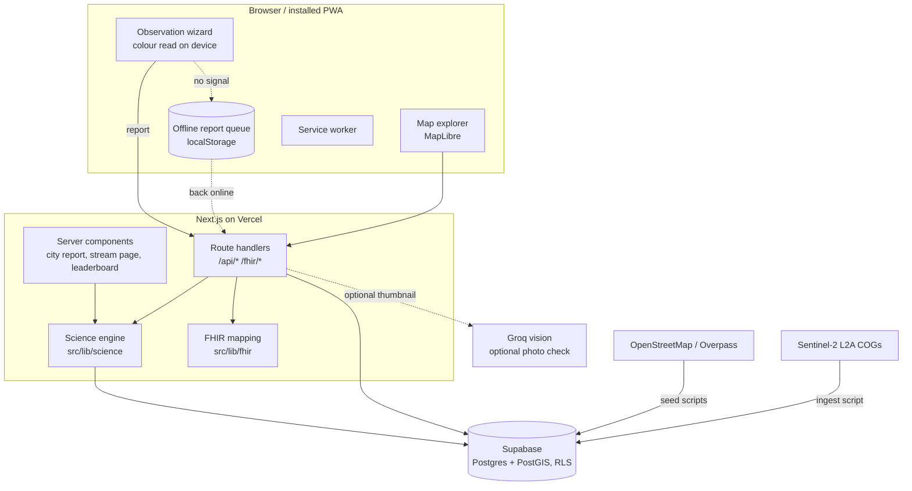
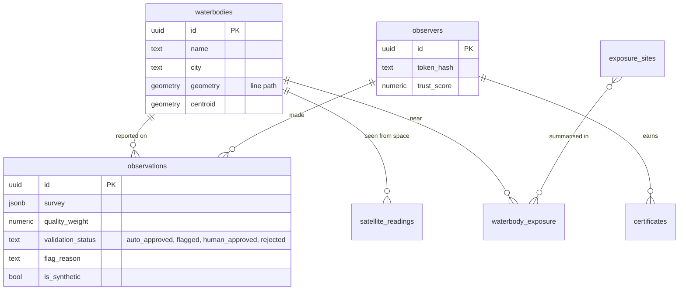

# Architecture

Rivulet is one Next.js 16 application (App Router, TypeScript strict) backed by Supabase (Postgres and PostGIS).
Pages, route handlers and the science engine live in the same repository and deploy together on Vercel. There is no
separate backend: the boundary that matters is between the **pure science and mapping code** (`src/lib`, unit-tested,
no I/O) and the **thin I/O shells** around it (route handlers, server components, scripts).

## Layers

| Layer | Where | Notes |
|---|---|---|
| Science engine | `src/lib/science/` | Pure functions: Forel–Ule colour, evidence, Bayesian estimate, trust, plausibility, One Health, satellite. Every constant is in `method-parameters.ts` as a cited standard or a declared prior. See [SCIENCE.md](SCIENCE.md) |
| FHIR mapping | `src/lib/fhir/` | Pure builders (`export.ts`, `observation.ts`, `capability.ts`, `code-system.ts`) shared by the routes and by the CI validation job |
| Data access | `src/lib/db/`, `src/lib/city-data.ts` | Supabase client with the anonymous key only; paginated reads (PostgREST caps a response at 1000 rows) |
| Identity and trust | `src/lib/identity/`, `src/lib/science/trust.ts` | Pseudonymous observer, SHA-256 of the token in the database, leave-one-out peer agreement |
| Moderation | `src/lib/moderation/`, `/moderate` | Shared-secret gate, review queue, optional Groq photo check |
| Credentials | `src/lib/credentials/` | Open Badges 3.0 credentials signed as compact JWS (EdDSA, `node:crypto`) |
| Offline | `public/sw.js`, `src/lib/offline/` | Service worker for the shell; a queue that holds reports until the connection returns |

## Data model

Migrations are in `supabase/migrations/` (0001–0009) and are applied in order.

## Security and privacy

- **Row-level security with column grants.** The anonymous role can read only the columns it needs; `observations.location`,
  `gps_accuracy_m`, `flag_reason` and `reviewed_at` are not granted, so no public query or export can leak an individual
  position.
- **No accounts.** An observer is a pseudonym; the token is kept in the browser and only its SHA-256 is stored.
- **Photos.** The colour is read on the device. The full photo is never uploaded. For the optional photo check a
  ~160 px JPEG thumbnail is sent once to Groq and never stored.
- **Secrets** live only in environment variables (`.env.local`, Vercel). Nothing secret is committed.
- **Moderation** is a shared secret, deliberately minimal: right for a two-person pilot, not a production moderation system.

## Performance

- The map page is a light shell. City data comes from `/api/city/<city>/map`, cached at the CDN (five minutes, then
  stale-while-revalidate), rounded to about a metre, and remembered by the browser. Changing city or colour layer does not
  reload the page, and the MapLibre map is created once and only swaps its line data.
- The city report and the leaderboard cache their expensive aggregation for one to two minutes and show a skeleton and a
  progress bar while they load.

## Validation

`.github/workflows/validate-fhir.yml` builds the OneAquaHealth IG from source (pinned commit, SUSHI) and runs the HL7
validator over output produced by the same functions the routes use. `ci.yml` runs the type-check and the unit tests.
