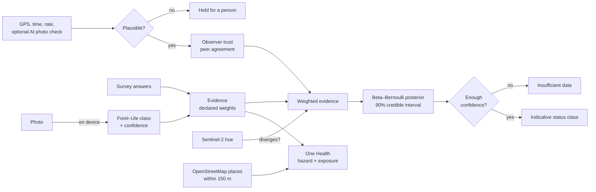

# The science engine

Rivulet's contribution is not another way to collect observations (OneAquaHealth already has one). It is the layer that
decides **how far an observation can be trusted and what it adds up to**, with the uncertainty attached. This document
describes that engine. The live, generated version, including every constant, is at
[/method](https://rivulet-xi.vercel.app/method); the code is in `src/lib/science/` with tests beside it.

## Design rules

1. **No unlabelled constant.** Each value in `method-parameters.ts` is either `standard` (with a source) or `prior` (with a
   rationale that ends in "uncalibrated"). The `/method` page renders that registry, so the documentation cannot drift.
2. **Missing evidence is never good news.** Below a minimum data confidence the result is "insufficient data"; no recent
   reports reads as "unknown", not "safe".
3. **Uncertainty travels with the answer.** Every status carries a 90% credible interval and a data-confidence figure.
4. **Rules, not a black box.** No learned model decides a status. The one AI component (an optional vision check that a
   photo shows water) can only send a report to a person; it never rejects or approves.
5. **Disagreement widens, never narrows.** If citizen and satellite colour diverge beyond a declared threshold, all weights
   for that stream are halved.

## Stages

| Stage | What it does | Basis | Code |
|---|---|---|---|
| Colour | sRGB → XYZ → hue angle → Forel–Ule class 1–21, on the device | Novoa, Wernand & van der Woerd 2013; Novoa et al. 2015 (WACODI-style); IEC 61966-2-1 | `forel-ule.ts`, `extract-colour.ts` |
| Evidence | Signs and animal groups add declared amounts of evidence for or against good condition | BMWP 1–10 family scale (Armitage et al. 1983) as a simplified proxy; other weights are declared priors | `indicators.ts` |
| Plausibility | GPS accuracy ≤ 250 m, ≤ 200 m from the stream, ≤ 5 reports per observer per hour, an optional AI photo check; reasons accumulate | Declared thresholds | `plausibility.ts` |
| Trust | Leave-one-out agreement with peers on the same streams, shrunk toward neutral, multiplies evidence weight | Shrinkage after Gelman et al. 2013, ch. 5 | `trust.ts`, `weighting.ts` |
| Estimate | Weighted pseudo-counts update a Beta posterior; mean, 90% equal-tailed interval, data confidence | Gelman et al. 2013, *Bayesian Data Analysis* | `bayes.ts`, `snapshot.ts` |
| Class | Five classes named after WFD Annex V; equal-width prior limits, not calibrated EQR boundaries | Directive 2000/60/EC (names only) | `wfd.ts` |
| One Health | Trust-weighted share of recent warning signs (hazard) × nearby playgrounds, schools, parks, dog areas, bathing and fishing spots (exposure) → concern for people, dogs, wildlife | Declared priors | `one-health.ts` |
| Satellite | Sentinel-2 hue angle along the stream vs residents' colour; divergence halves weights | van der Woerd & Wernand 2015, 2018 (calibration **not yet adopted**) | `satellite.ts` |

## Relation to the OneAquaHealth field protocols

The OneAquaHealth [Field Sampling Protocols for Urban Stream Ecosystems](https://zenodo.org/records/20344421) (Calapez et
al. 2026, CC-BY-4.0) are professional procedures for site characterisation, ecosystem-health indicators (benthic
macroinvertebrates, fish, birds, diatoms, macrophytes, riparian vegetation) and biological risk indicators. Rivulet's
resident survey is a two-minute visual complement, not a substitute:

| Protocol topic | What Rivulet asks a resident | Status |
|---|---|---|
| Physicochemical parameters (pH, oxygen, temperature, nitrate) | Optional test-kit readings, coded with OneAquaHealth codes and UCUM units | Direct, when a resident has a kit |
| Benthic macroinvertebrates | Which of six recognisable groups they saw | **Proxy** on the BMWP family scale, coded `invertebrate-groups-score` in Rivulet's system, not the guide's `macroinvertebreates` count |
| Hydromorphology | Flow as seen: normal, low, stagnant, high | **Proxy**, coded `flow-state` in Rivulet's system, not the guide's `hydrology` concept |
| Water appearance, smell, foam, litter | Colour, clarity, odour, foam, litter | Resident-reported signs, coded in Rivulet's own system, never as laboratory analytes |
| Fish, birds, diatoms, macrophytes, vegetation, disease vectors | Not asked | Out of scope for a two-minute check |

## Known limits

Colour comes from an uncalibrated phone camera; the class limits are priors; trust is agreement, not truth; the satellite
conversion is a declared placeholder; there has been no validation against independent measurements yet. The pilot's
purpose is to obtain that comparison (see the pilot plan in [SUBMISSION.md](SUBMISSION.md)).
